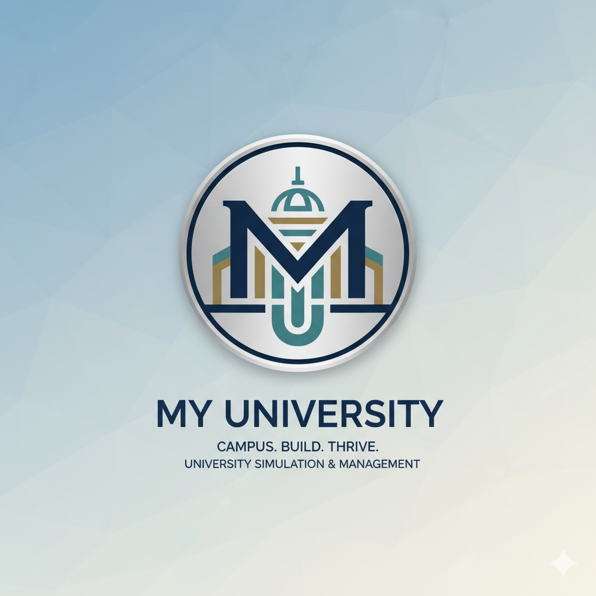

 

  

  <h3 align="center">My University | 模拟大学</h3>

  

    🎓 打造你的梦想校园，培养未来的精英！ 
    一个跨平台的大学建造与经营模拟游戏。
     
     
    <a href="https://github.com/YourUsername/My-University/issues">报告Bug</a>
    ·
    <a href="https://github.com/YourUsername/My-University/issues">提出新功能</a>
  

<!-- 徽章区域 -->

<!-- 跨平台徽章 -->

 

## 📖 项目介绍 (About The Game)

**My University** 是一款受《双点校园》、《城市天际线》等经典游戏启发的模拟经营游戏。玩家将扮演一名新上任的大学校长，从一片荒地开始，规划校园布局，招聘顶尖教授，管理学校财务，并处理各种突发的校园事件。

本项目旨在实现 **PC 与 移动端 (iOS/Android)** 的跨平台体验，让玩家随时随地都能管理自己的大学。

### 🎮 核心玩法

*   **🏗️ 自由建造**：自由规划教学楼、宿舍、实验室，适配触摸屏与鼠标操作。
*   **👨‍🏫 人员管理**：招聘教授、清洁工和行政人员。关注他们的心情和薪资要求。
*   **🎓 学生培养**：排课、设立奖学金、处理学生投诉。保证毕业率是首要任务！
*   **💰 财务经营**：通过学费、政府拨款和校友捐赠来维持收支平衡。
*   **🌲 随机事件**：应对流感爆发、校园恋爱、学术丑闻或突如其来的教育部检查。
（暂时这么写）
 

## 📸 游戏截图 (Screenshots)

  
  

 

## 👨‍💻 关于开发者 (About Developer)

本项目是由本人（**一名计算机专业的大一学生（目前）**）在大学期间独立发起的个人项目。

*   **初衷**：玩天际线玩多了导致的喵~
*   **AI 赋能**：在开发过程中，我深度使用了 **Google AI Studio**。帮助我解决了许多算法逻辑和架构设计上的难题。这是一个探索 AI 辅助游戏开发的实验性项目。（希望能赚米子）

 

## 🛠️ 技术栈 (Tech Stack)

本项目基于以下技术构建：

*   **游戏引擎**:
*   **编程语言**: C# / TS / GDScript
*   **AI 辅助**: Google AI Studio (Gemini Models) - 用于代码生成与逻辑优化
*   **目标平台**: Windows / macOS / Android / iOS

 
